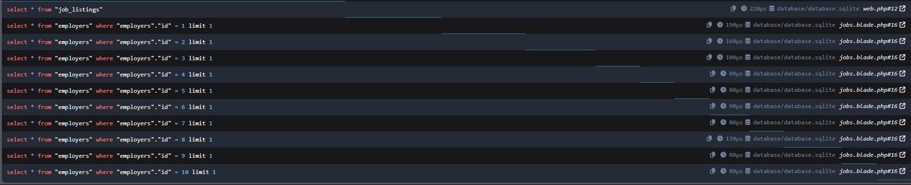
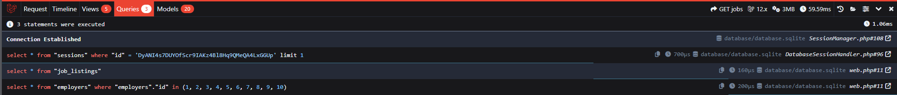

# Eager Loading and the N+1 Problem
The `N+1` problem refers to database queries executed within a loop, rather than making a single query that loads the required data upfront.

Currently the jobs view is doing exactly that:
```php
    <div class="space-y-4">
        @foreach($jobs as $job)
            <a href="jobs/{{ $job['id'] }}" class="block px-4 py-6 border border-gray-200 rounded-lg">
                <div class="font-bold text-blue-500">{{ $job->employer->name }}</div>
                <div><strong>{{ $job['title'] }}</strong>: Pays {{ $job['salary'] }} per year</div>
            </a>
        @endforeach
    </div>
```

Everytime a relationship is referenced (like `employer` in the loop above) another query is being executed. This is called `lazy loading`. And because this relationship is being referenced inside a loop that query will be executed however many times that loop iterates over the `$jobs` array. On a real jobsboard that could easily run into the hundreds or even thousands very quickly, introducing significant overhead to the application.

## Laravel debug bar
The laravel debug bar gives a gui view of all sorts of metrics, including queries. To install it copy and paste the install command:
```
composer require barryvdh/laravel-debugbar --dev
```
A quick inspection of the debug bar queries tab shows 12 queries being executed, 10 of which are almost identical:

*A lazy loaded query performs a new query for each iteration of the loop*


[Laravel Debug Bar on github](https://github.com/barryvdh/laravel-debugbar)

## Fix the problem
To fix this issue we can implement `eager loading`. Laravel provides a `with` method that can be used on the class obejct. It allows a relationship to be referenced `with` the query so when the jobs are retrieved from the database the specified relationship (in this case `employer`) will be retrieved with them.

```php
Route::get('/jobs', function () {
    $jobs = Job::with('employer')->get();

    return view('jobs', [
        'jobs' => $jobs,
    ]);
});
```

Now instead of the relationship being called by the loop it is called on the original query. The loop doesn't actually change at all but when `$job->employer->name` is used the data is coming directly from the `$jobs` array instead of executing a new query for each job.


*An eager loaded query makes a single query and gets all the data it needs ahead of time*

It's worth noting though that although `get()` is used here if the database had 1000's of jobs this probably wouldn't be suitable and `pagination` or `limit` would be a better idea. The `get()` method is just saying `SELECT *`.

## To be lazy or not?
If it's desirable lazy loading can actually be completely disabled in the `App\Providers\AppServiceProvider.php`. The `AppServiceProvider` can be thought of as a configuration file for the app. In this case the configuration would be lazy loading disabled. Specifically this would live in the `boot()` method which is loaded after all other project dependencies have been fully loaded.

```php
    public function boot(): void
    {
        Model::preventLazyLoading();
    }
```

Now if any attempt is made to lazy load anything Laravel will throw an error and the lazy loading will have to be fixed to restore functionality.